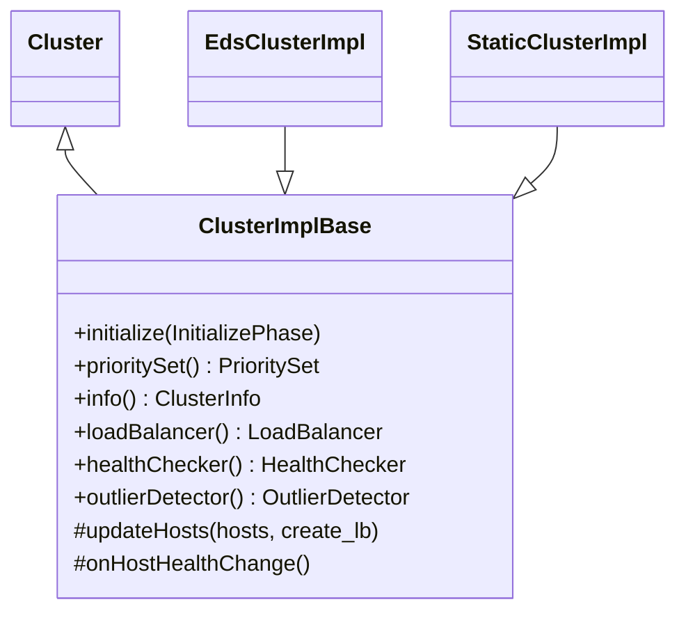

# Part 39: ClusterImplBase

**File:** `source/common/upstream/cluster_impl.h`  
**Namespace:** `Envoy::Upstream`

## Summary

`ClusterImplBase` is the base class for cluster implementations (e.g. `EdsClusterImpl`, `StaticClusterImpl`). It manages PrioritySet, LoadBalancer, HealthChecker, OutlierDetector, and cluster info. Handles host updates and load balancer creation.

## UML Diagram

## Important Functions

| Function | One-line description |
|----------|----------------------|
| `initialize(InitializePhase)` | Initializes cluster. |
| `prioritySet()` | Returns PrioritySet. |
| `info()` | Returns ClusterInfo. |
| `loadBalancer()` | Returns LoadBalancer. |
| `updateHosts(hosts, create_lb)` | Updates host set; optionally creates LB. |
| `onHostHealthChange()` | Callback when host health changes. |
