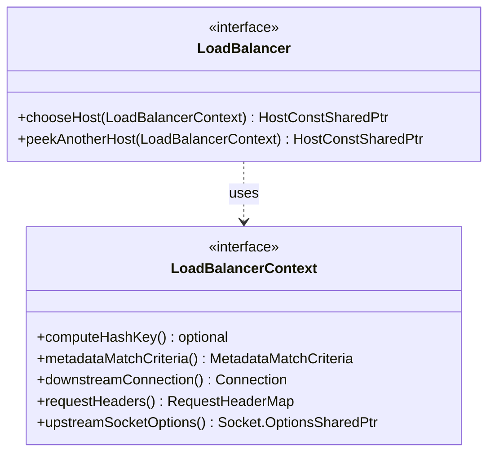

# Part 40: LoadBalancer

**File:** `envoy/upstream/load_balancer.h`  
**Namespace:** `Envoy::Upstream`

## Summary

`LoadBalancer` selects an upstream host for a request. It receives `LoadBalancerContext` (route, request headers, etc.) and returns `HostConstSharedPtr`. Implementations: RoundRobin, Random, LeastRequest, RingHash, Maglev, etc.

## UML Diagram

## LoadBalancer

| Function | One-line description |
|----------|----------------------|
| `chooseHost(LoadBalancerContext)` | Selects host for request. |
| `peekAnotherHost(LoadBalancerContext)` | Peeks alternate host without selecting. |

## LoadBalancerContext

| Function | One-line description |
|----------|----------------------|
| `computeHashKey()` | Hash for consistent hashing. |
| `metadataMatchCriteria()` | Metadata for subset LB. |
| `downstreamConnection()` | Downstream connection. |
| `requestHeaders()` | Request headers. |
