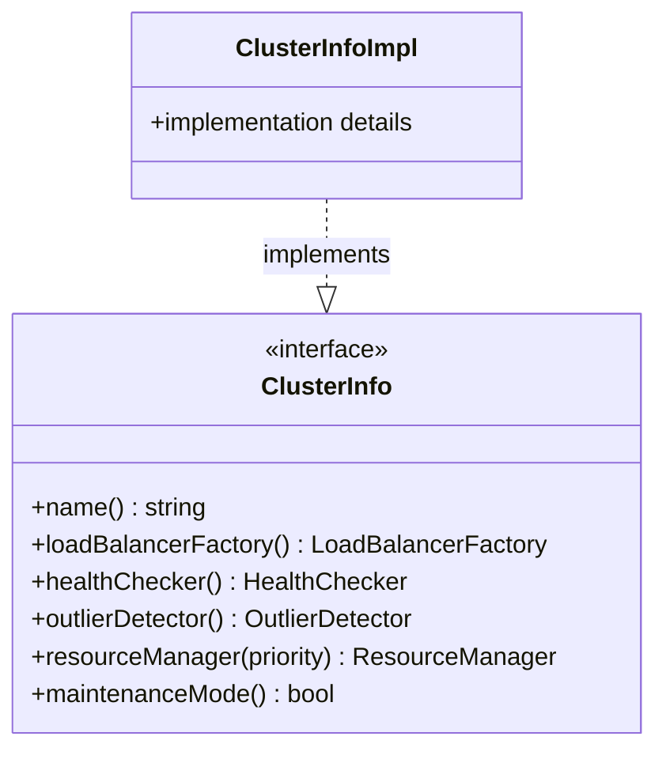

# Part 41: ClusterInfo

**File:** `envoy/upstream/upstream.h`  
**Namespace:** `Envoy::Upstream`

## Summary

`ClusterInfo` is the interface for cluster metadata and configuration. It provides cluster name, load balancer type, health checker, outlier detector, resource limits, and connection pool settings. Implemented by `ClusterInfoImpl`.

## UML Diagram

## Important Functions

| Function | One-line description |
|----------|----------------------|
| `name()` | Returns cluster name. |
| `loadBalancerFactory()` | Returns LB factory for type. |
| `healthChecker()` | Returns health checker. |
| `outlierDetector()` | Returns outlier detector. |
| `resourceManager(priority)` | Returns resource manager per priority. |
| `maintenanceMode()` | Returns whether cluster is in maintenance. |
