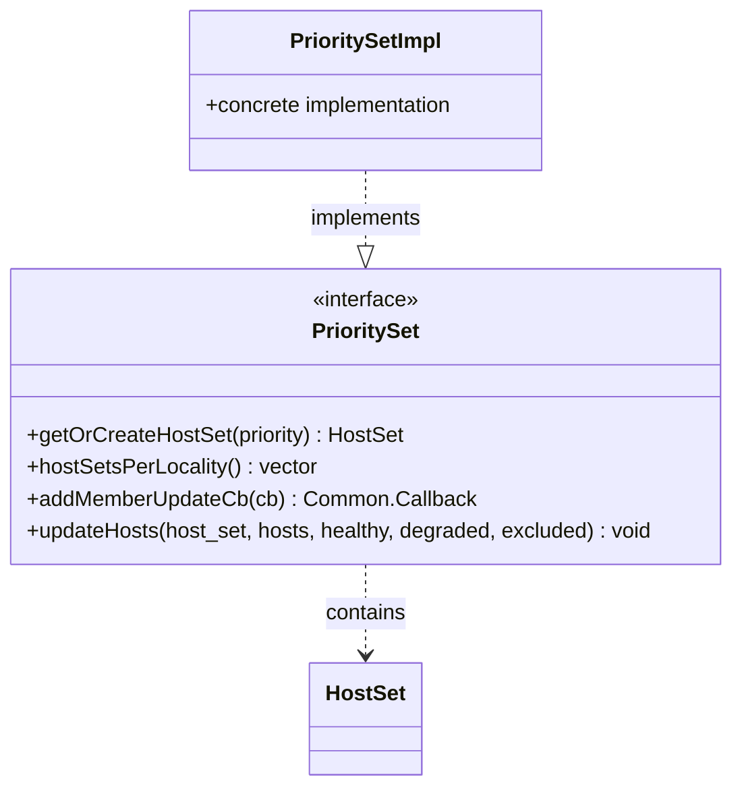

# Part 42: PrioritySet

**File:** `envoy/upstream/upstream.h`  
**Namespace:** `Envoy::Upstream`

## Summary

`PrioritySet` manages multiple priority levels of hosts for a cluster. Each priority hosts a `HostSet`; higher priorities are tried first during load balancing. Supports callbacks for membership changes.

## UML Diagram

## Important Functions

| Function | One-line description |
|----------|----------------------|
| `getOrCreateHostSet(priority)` | Gets or creates HostSet for priority. |
| `hostSetsPerLocality()` | Returns HostSets grouped by locality. |
| `addMemberUpdateCb(cb)` | Registers callback for host changes. |
| `updateHosts(...)` | Updates hosts in a HostSet. |
