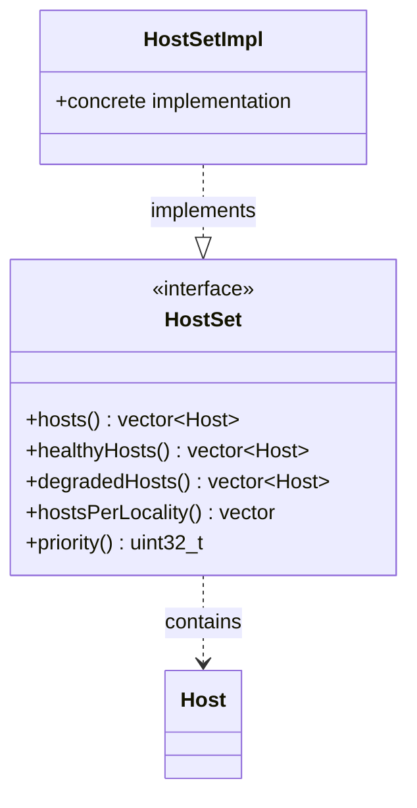

# Part 43: HostSet

**File:** `envoy/upstream/upstream.h`  
**Namespace:** `Envoy::Upstream`

## Summary

`HostSet` holds the collection of hosts for a cluster priority. It provides healthy, degraded, and excluded host lists; locality-aware hosts; and metadata for load balancing decisions.

## UML Diagram

## Important Functions

| Function | One-line description |
|----------|----------------------|
| `hosts()` | Returns all hosts in set. |
| `healthyHosts()` | Returns healthy hosts. |
| `degradedHosts()` | Returns degraded hosts. |
| `hostsPerLocality()` | Returns hosts grouped by locality. |
| `priority()` | Returns priority level. |
