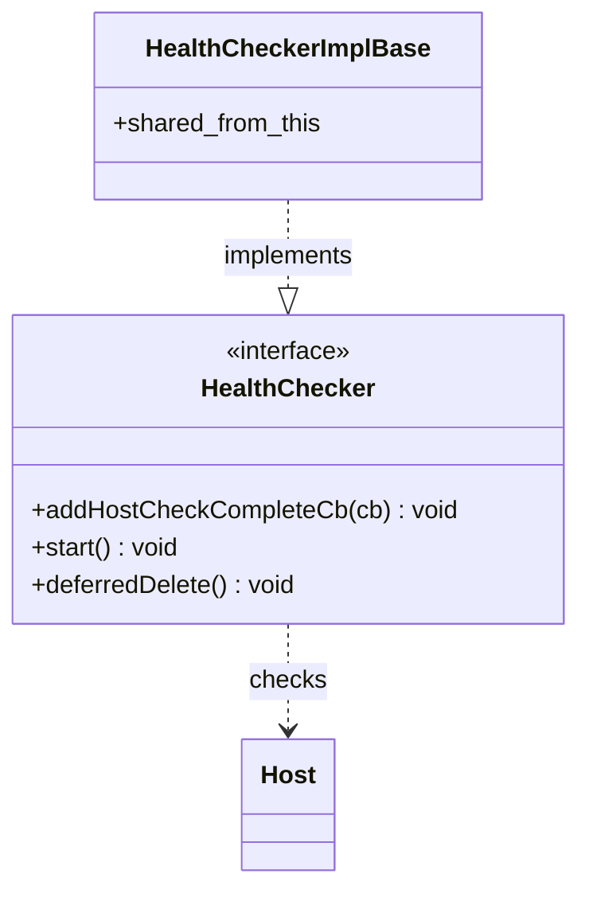

# Part 44: HealthChecker

**File:** `envoy/upstream/health_checker.h`  
**Namespace:** `Envoy::Upstream`

## Summary

`HealthChecker` performs active health checks on upstream hosts. It sends periodic probes (HTTP, TCP, gRPC) and updates host health status. Implementations include `HealthCheckerImplBase` and protocol-specific extensions.

## UML Diagram

## Important Functions

| Function | One-line description |
|----------|----------------------|
| `addHostCheckCompleteCb(cb)` | Registers callback on check completion. |
| `start()` | Starts health checking. |
| `deferredDelete()` | Schedules deferred deletion. |
