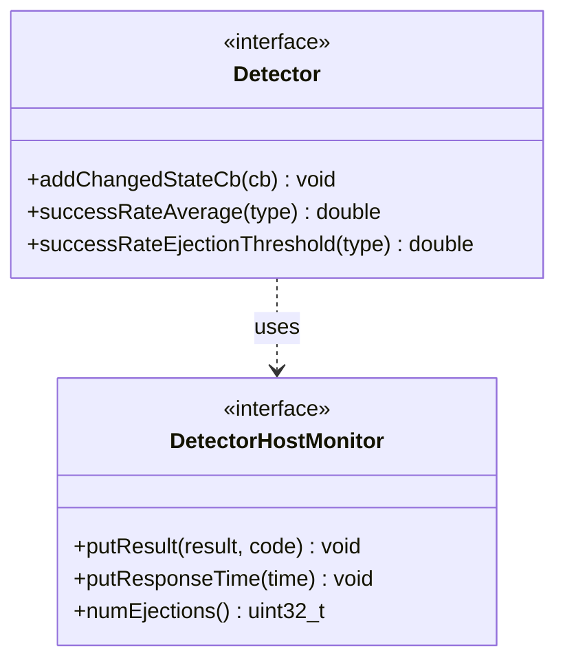

# Part 45: OutlierDetector

**File:** `envoy/upstream/outlier_detection.h`  
**Namespace:** `Envoy::Upstream::Outlier`

## Summary

`Outlier::Detector` monitors per-host performance and ejects hosts that fail success-rate or latency thresholds. Uses `DetectorHostMonitor` for per-host data; `putResult` and `putResponseTime` feed the detector.

## UML Diagram

## Important Functions

| Function | One-line description |
|----------|----------------------|
| `addChangedStateCb(cb)` | Registers callback on eject/uneject. |
| `successRateAverage(type)` | Returns average success rate. |
| `successRateEjectionThreshold(type)` | Returns ejection threshold. |
| `putResult(result)` | Records per-host result. |
| `putResponseTime(time)` | Records response time. |
