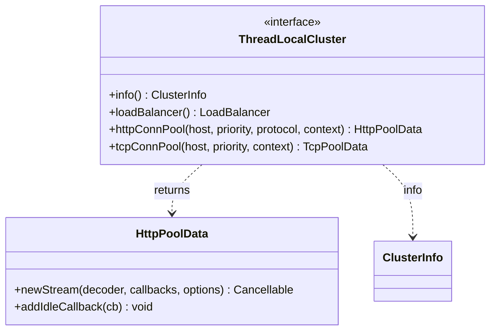

# Part 46: ThreadLocalCluster

**File:** `envoy/upstream/thread_local_cluster.h`  
**Namespace:** `Envoy::Upstream`

## Summary

`ThreadLocalCluster` provides per-thread access to cluster data (load balancer, connection pools) for a worker thread. Used by the router to obtain HTTP/TCP connection pools and select hosts.

## UML Diagram

## Important Functions

| Function | One-line description |
|----------|----------------------|
| `info()` | Returns cluster info. |
| `loadBalancer()` | Returns load balancer. |
| `httpConnPool(...)` | Returns HTTP connection pool for host. |
| `tcpConnPool(...)` | Returns TCP connection pool. |
| `newStream()` | Creates new stream on pool. |
