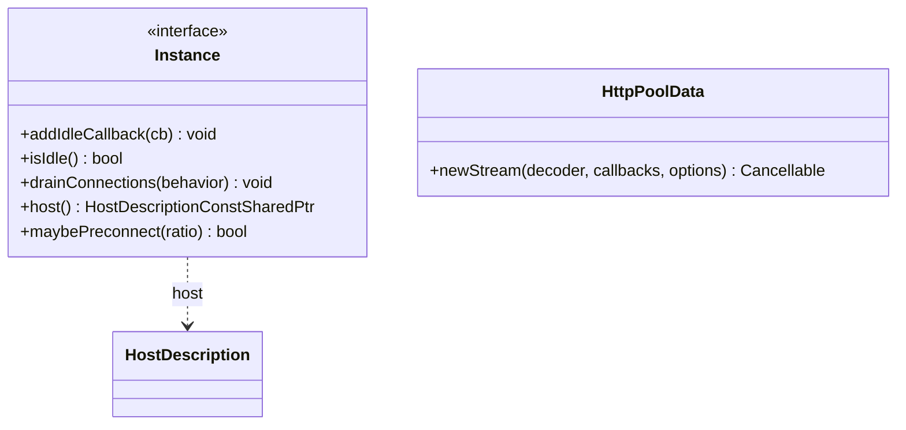

# Part 47: ConnectionPool

**File:** `envoy/common/conn_pool.h`  
**Namespace:** `Envoy::ConnectionPool`

## Summary

`ConnectionPool::Instance` is the generic interface for connection pooling. It manages upstream connections, supports idle callbacks, draining, and preconnection. HTTP and TCP pools extend this interface.

## UML Diagram

## Important Functions

| Function | One-line description |
|----------|----------------------|
| `addIdleCallback(cb)` | Registers callback when pool idle. |
| `isIdle()` | Returns true if no connections. |
| `drainConnections(behavior)` | Drains connections. |
| `host()` | Returns host for pool. |
| `maybePreconnect(ratio)` | Preconnects if needed. |
