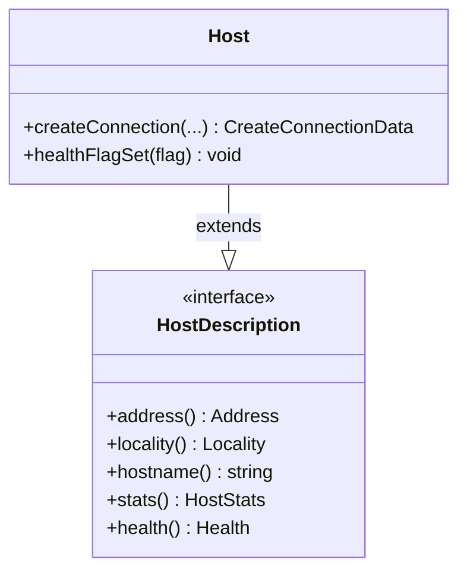

# Part 48: HostDescription

**File:** `envoy/upstream/host_description.h`  
**Namespace:** `Envoy::Upstream`

## Summary

`HostDescription` is the read-only interface for host metadata: address, locality, health status, and stats. Implemented by `HostDescriptionImplBase`; `Host` extends it with mutable state.

## UML Diagram

## Important Functions

| Function | One-line description |
|----------|----------------------|
| `address()` | Returns host address. |
| `locality()` | Returns locality. |
| `hostname()` | Returns hostname. |
| `stats()` | Returns host stats. |
| `health()` | Returns coarse health status. |
