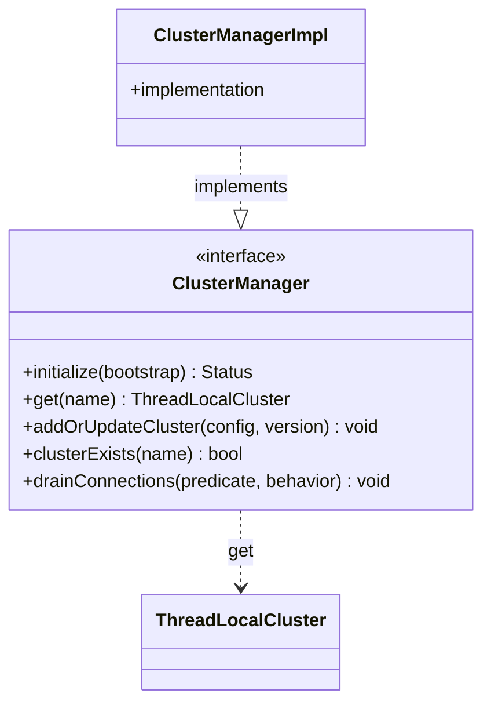

# Part 49: ClusterManager

**File:** `envoy/upstream/cluster_manager.h`  
**Namespace:** `Envoy::Upstream`

## Summary

`ClusterManager` manages upstream clusters, connection pools, and load balancing. It initializes from bootstrap, supports CDS updates, and provides per-thread `ThreadLocalCluster` access. Implemented by `ClusterManagerImpl`.

## UML Diagram

## Important Functions

| Function | One-line description |
|----------|----------------------|
| `initialize(bootstrap)` | Initializes from bootstrap. |
| `get(name)` | Returns ThreadLocalCluster. |
| `addOrUpdateCluster(config, version)` | Adds/updates cluster via API. |
| `clusterExists(name)` | Checks if cluster exists. |
| `drainConnections(...)` | Drains connections by predicate. |
