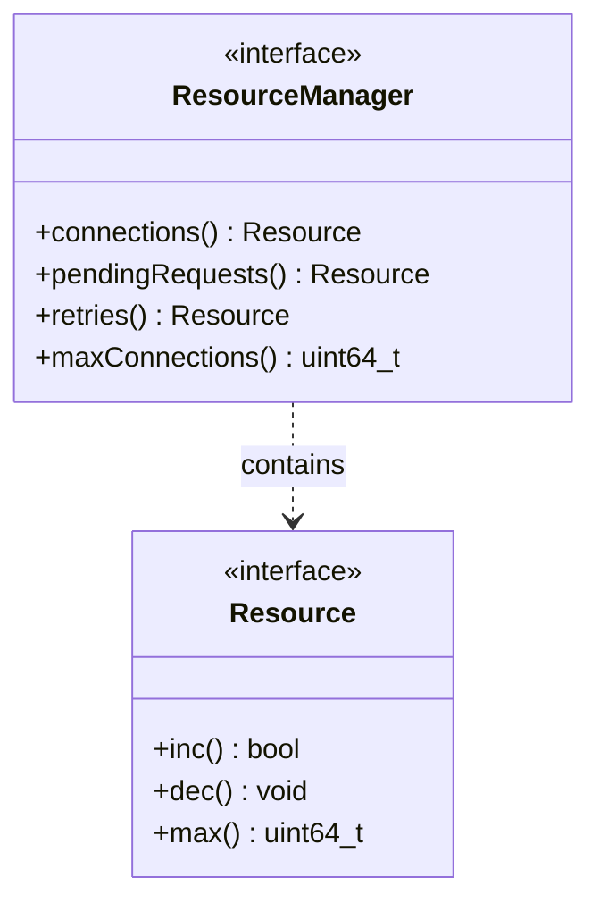

# Part 50: ResourceManager

**File:** `envoy/upstream/resource_manager.h`  
**Namespace:** `Envoy::Upstream`

## Summary

`ResourceManager` enforces per-cluster resource limits (connections, pending requests). It prevents resource exhaustion and provides circuit-breaking behavior. Implemented by `ResourceManagerImpl`.

## UML Diagram

## Important Functions

| Function | One-line description |
|----------|----------------------|
| `connections()` | Returns connection resource. |
| `pendingRequests()` | Returns pending request resource. |
| `retries()` | Returns retry resource. |
| `maxConnections()` | Returns max connections. |
