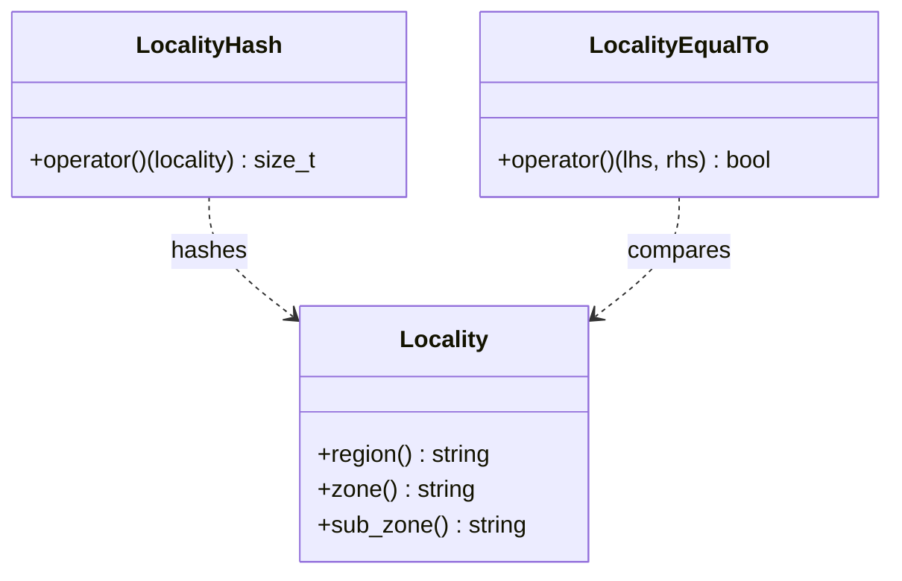

# Part 51: Locality

**File:** `envoy/upstream/locality.h`, `envoy/config/core/v3/base.pb.h`  
**Namespace:** `Envoy::Upstream`, `envoy::config::core::v3`

## Summary

`Locality` is the region/zone/sub_zone identifier for hosts. Used for locality-aware load balancing.

## UML Diagram

## Important Functions

| Function | One-line description |
|----------|----------------------|
| `region()` | Returns region. |
| `zone()` | Returns zone. |
| `sub_zone()` | Returns sub_zone. |
| `LocalityHash` | Hash for locality in maps. |
| `LocalityEqualTo` | Equality for locality. |
