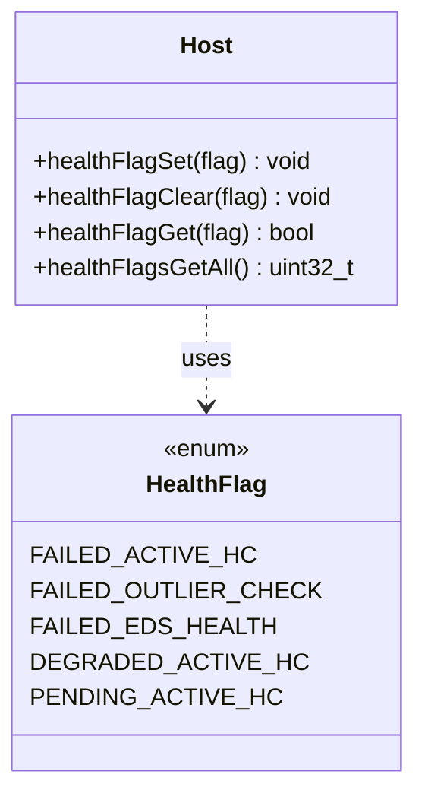

# Part 52: HealthFlag

**File:** `envoy/upstream/upstream.h`  
**Namespace:** `Envoy::Upstream::Host`

## Summary

`Host::HealthFlag` is an enum of health flags for hosts: FAILED_ACTIVE_HC, FAILED_OUTLIER_CHECK, DEGRADED_ACTIVE_HC, PENDING_ACTIVE_HC, etc. Hosts use these for load balancing decisions.

## UML Diagram

## Important Functions

| Function | One-line description |
|----------|----------------------|
| `healthFlagSet(flag)` | Sets host health flag. |
| `healthFlagClear(flag)` | Clears host health flag. |
| `healthFlagGet(flag)` | Returns whether flag set. |
| `healthFlagsGetAll()` | Returns all flags as bitset. |
