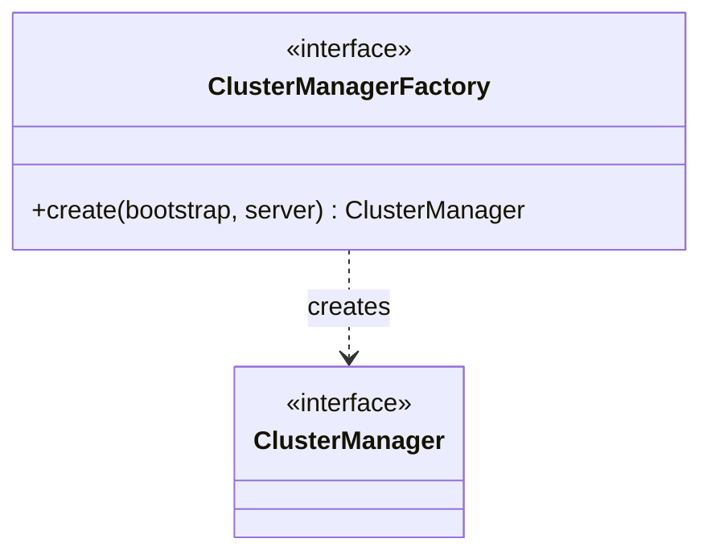

# Part 53: ClusterManagerFactory

**File:** `envoy/upstream/cluster_manager.h`  
**Namespace:** `Envoy::Upstream`

## Summary

`ClusterManagerFactory` creates `ClusterManager` instances. Used during server initialization to bootstrap the cluster manager with the right configuration.

## UML Diagram

## Important Functions

| Function | One-line description |
|----------|----------------------|
| `create(bootstrap, server)` | Creates ClusterManager instance. |
