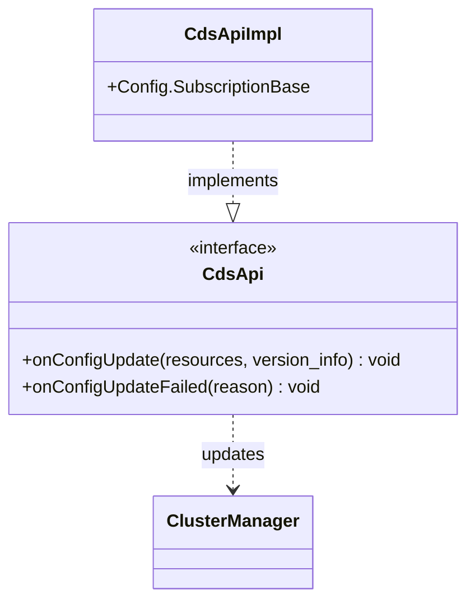

# Part 54: CdsApi

**File:** `envoy/upstream/cluster_manager.h`  
**Namespace:** `Envoy::Upstream`

## Summary

`CdsApi` is the xDS subscription interface for Cluster Discovery Service. It receives cluster configs from the management server and updates the cluster manager. Implemented by `CdsApiImpl`.

## UML Diagram

## Important Functions

| Function | One-line description |
|----------|----------------------|
| `onConfigUpdate(resources, version_info)` | Handles CDS config update. |
| `onConfigUpdateFailed(reason)` | Handles config failure. |
