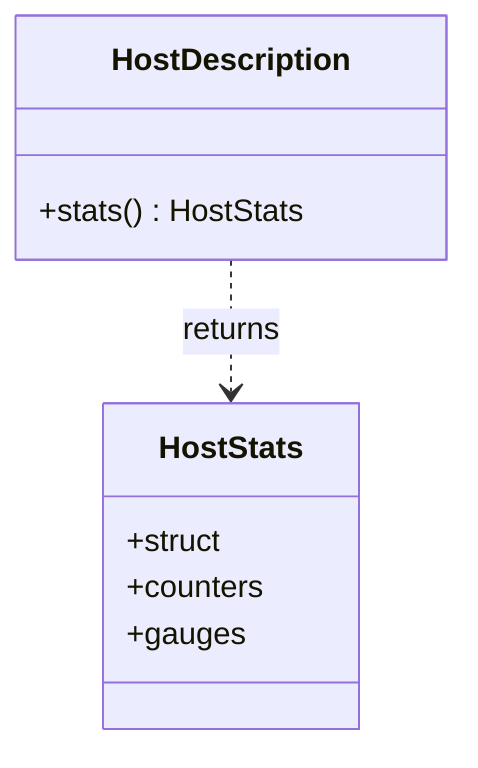

# Part 55: HostStats

**File:** `envoy/upstream/host_description.h`  
**Namespace:** `Envoy::Upstream`

## Summary

`HostStats` is a struct holding per-host counters and gauges (e.g. failures, active connections). Used by `HostDescription::stats()` for observability.

## UML Diagram

## Important Functions

| Function | One-line description |
|----------|----------------------|
| `HostDescription::stats()` | Returns host stats. |
| `counters()` | Returns host counters. |
| `gauges()` | Returns host gauges. |
