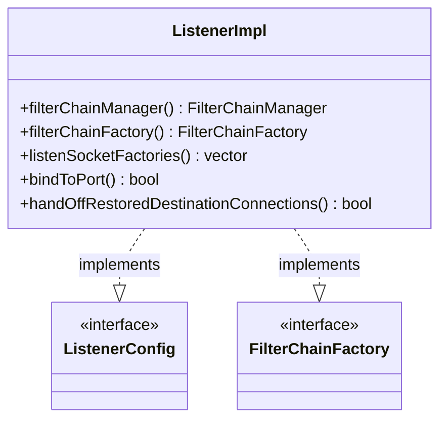

# Part 56: ListenerImpl

**File:** `source/common/listener_manager/listener_impl.h`  
**Namespace:** `Envoy::Server`

## Summary

`ListenerImpl` implements `Network::ListenerConfig` and `Network::FilterChainFactory`. It represents a configured listener with filter chains, socket factories, and connection handling. Created by `ListenerManagerImpl`.

## UML Diagram

## Important Functions

| Function | One-line description |
|----------|----------------------|
| `filterChainManager()` | Returns filter chain manager. |
| `filterChainFactory()` | Returns filter chain factory. |
| `listenSocketFactories()` | Returns socket factories. |
| `bindToPort()` | Whether listener binds to port. |
| `handOffRestoredDestinationConnections()` | Whether to hand off to other listener. |
