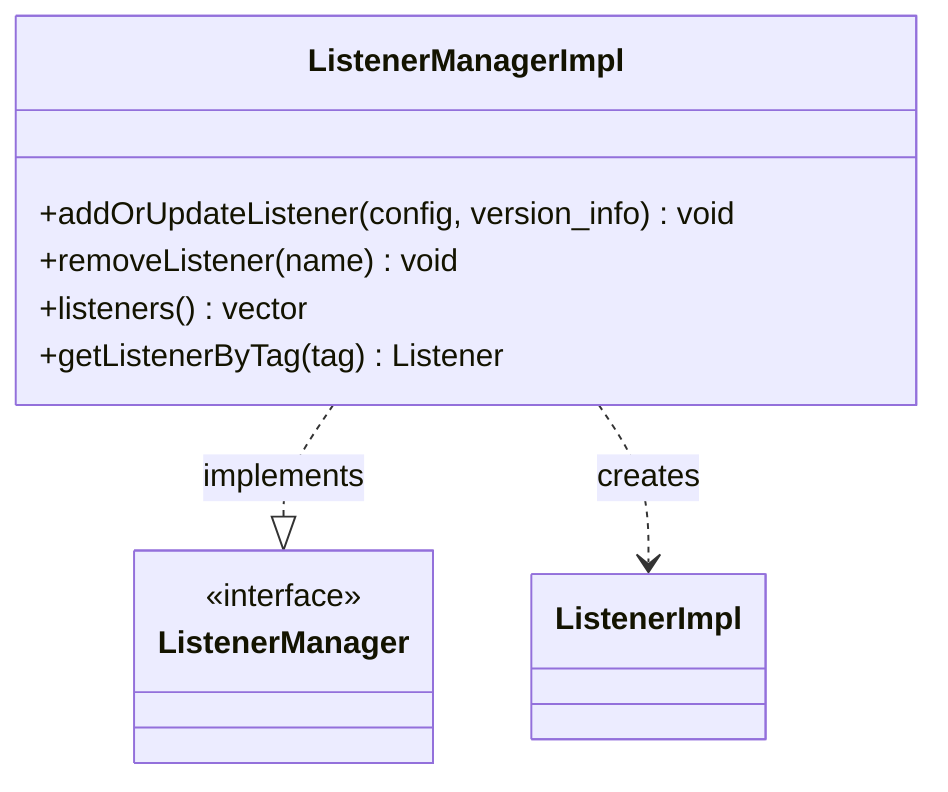

# Part 57: ListenerManagerImpl

**File:** `source/common/listener_manager/listener_manager_impl.h`  
**Namespace:** `Envoy::Server`

## Summary

`ListenerManagerImpl` manages listener lifecycle: add, update, remove. It creates `ListenerImpl` instances and coordinates with `ConnectionHandlerImpl` for socket binding and connection acceptance.

## UML Diagram

## Important Functions

| Function | One-line description |
|----------|----------------------|
| `addOrUpdateListener(config, version_info)` | Adds or updates listener. |
| `removeListener(name)` | Removes listener. |
| `listeners()` | Returns active listeners. |
| `getListenerByTag(tag)` | Gets listener by tag. |
