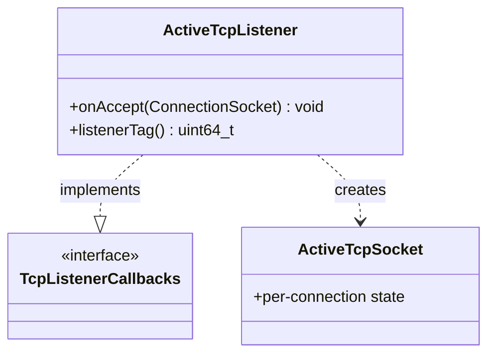

# Part 58: ActiveTcpListener

**File:** `source/common/listener_manager/active_tcp_listener.h`  
**Namespace:** `Envoy::Server`

## Summary

`ActiveTcpListener` implements `Network::TcpListenerCallbacks` and handles accepted TCP connections. It creates `ActiveTcpSocket` for each connection and passes them through listener filters.

## UML Diagram

## Important Functions

| Function | One-line description |
|----------|----------------------|
| `onAccept(socket)` | Handles new connection. |
| `listenerTag()` | Returns listener tag. |
