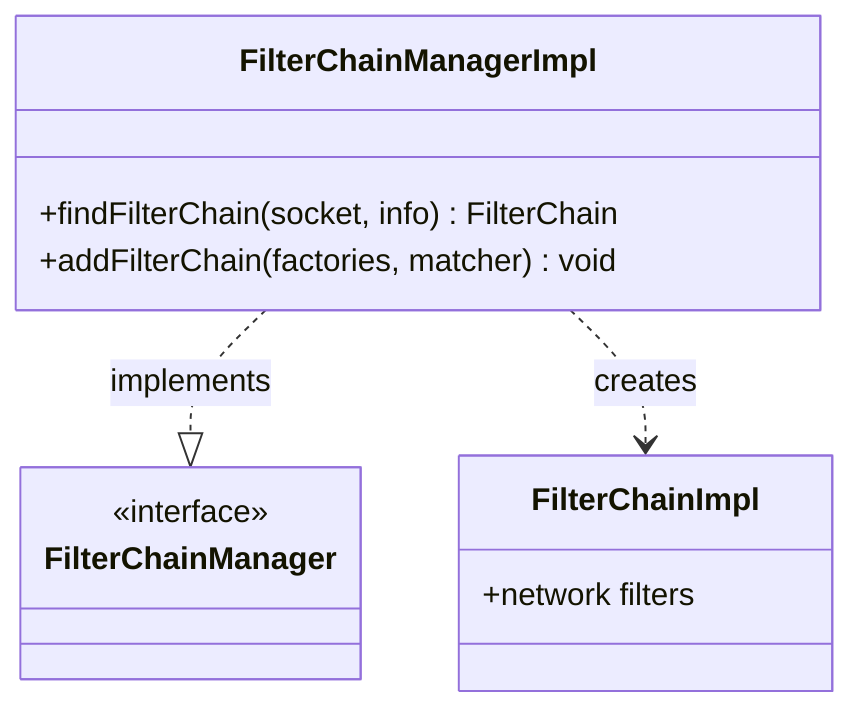

# Part 59: FilterChainManagerImpl

**File:** `source/common/listener_manager/filter_chain_manager_impl.h`  
**Namespace:** `Envoy::Server`

## Summary

`FilterChainManagerImpl` implements `Network::FilterChainManager` and manages filter chains for a listener. It matches connections to filter chains via `findFilterChain` and creates `FilterChainImpl` instances.

## UML Diagram

## Important Functions

| Function | One-line description |
|----------|----------------------|
| `findFilterChain(socket, info)` | Finds matching filter chain. |
| `addFilterChain(factories, matcher)` | Adds filter chain. |
