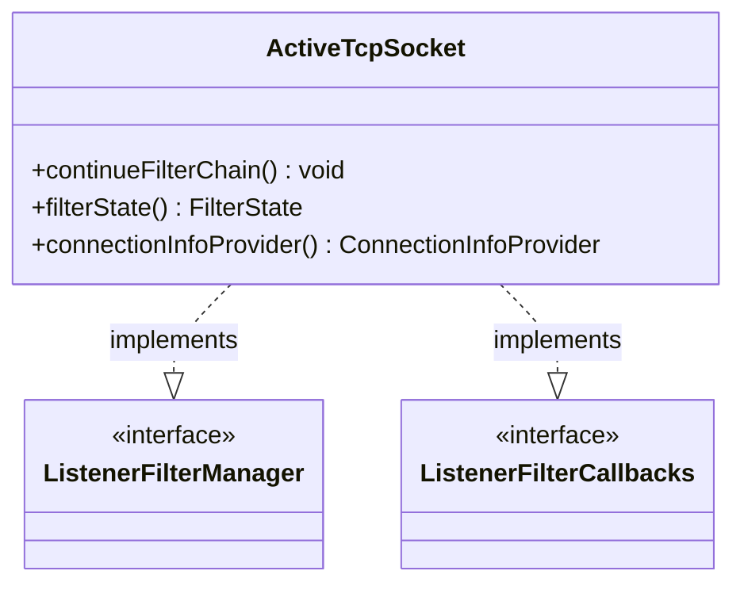

# Part 60: ActiveTcpSocket

**File:** `source/common/listener_manager/active_tcp_socket.h`  
**Namespace:** `Envoy::Server`

## Summary

`ActiveTcpSocket` represents an accepted TCP connection during listener filter processing. It implements `ListenerFilterManager` and `ListenerFilterCallbacks`; after filters complete, it creates the network connection.

## UML Diagram

## Important Functions

| Function | One-line description |
|----------|----------------------|
| `continueFilterChain()` | Continues to next filter. |
| `filterState()` | Returns filter state. |
| `connectionInfoProvider()` | Returns connection info. |
