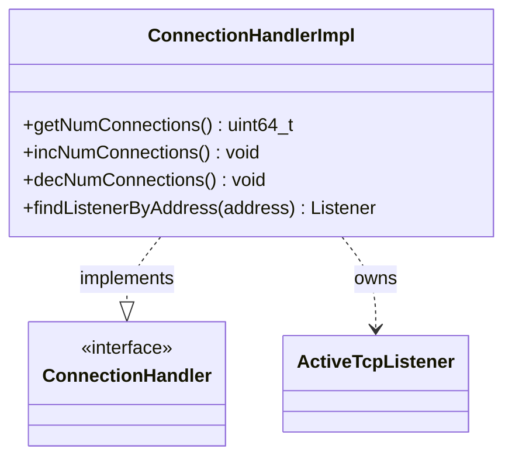

# Part 61: ConnectionHandlerImpl

**File:** `source/common/listener_manager/connection_handler_impl.h`  
**Namespace:** `Envoy::Server`

## Summary

`ConnectionHandlerImpl` implements `Network::ConnectionHandler` and dispatches connections to listeners. It owns `ActiveTcpListener` instances and balances connections across workers.

## UML Diagram

## Important Functions

| Function | One-line description |
|----------|----------------------|
| `getNumConnections()` | Returns connection count. |
| `incNumConnections()` | Increments connection count. |
| `decNumConnections()` | Decrements connection count. |
| `findListenerByAddress(address)` | Finds listener by address. |
