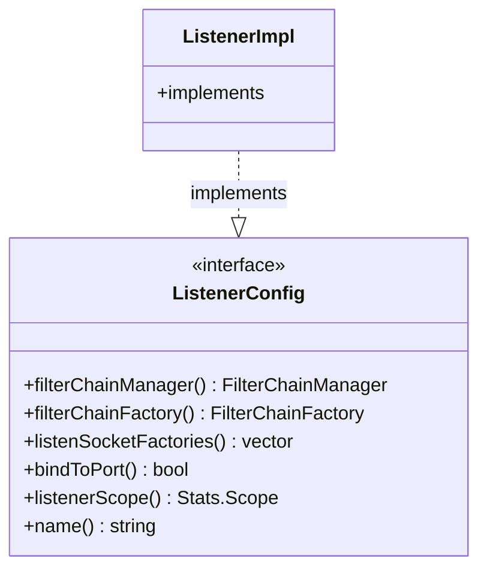

# Part 62: ListenerConfig

**File:** `envoy/network/listener.h`  
**Namespace:** `Envoy::Network`

## Summary

`ListenerConfig` is the interface for listener configuration. It provides filter chain manager, filter chain factory, socket factories, bind port, buffer limits, and listener metadata.

## UML Diagram

## Important Functions

| Function | One-line description |
|----------|----------------------|
| `filterChainManager()` | Returns filter chain manager. |
| `filterChainFactory()` | Returns filter chain factory. |
| `listenSocketFactories()` | Returns socket factories. |
| `bindToPort()` | Whether to bind to port. |
| `name()` | Returns listener name. |
