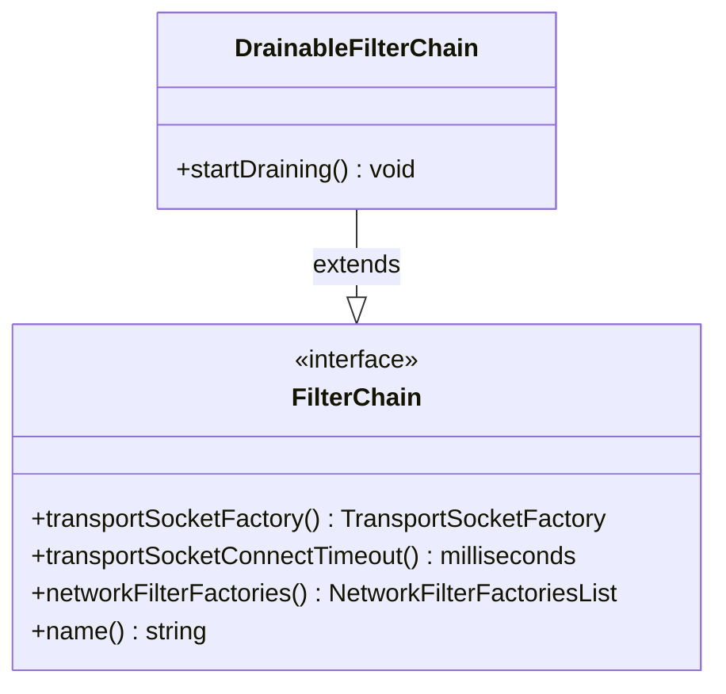

# Part 63: FilterChain

**File:** `envoy/network/filter.h`  
**Namespace:** `Envoy::Network`

## Summary

`FilterChain` is the interface for a single filter chain. It provides transport socket factory, network filter factories, and metadata. Used when creating a new connection.

## UML Diagram

## Important Functions

| Function | One-line description |
|----------|----------------------|
| `transportSocketFactory()` | Returns transport socket factory. |
| `networkFilterFactories()` | Returns network filter factories. |
| `name()` | Returns filter chain name. |
| `transportSocketConnectTimeout()` | Returns connect timeout. |
