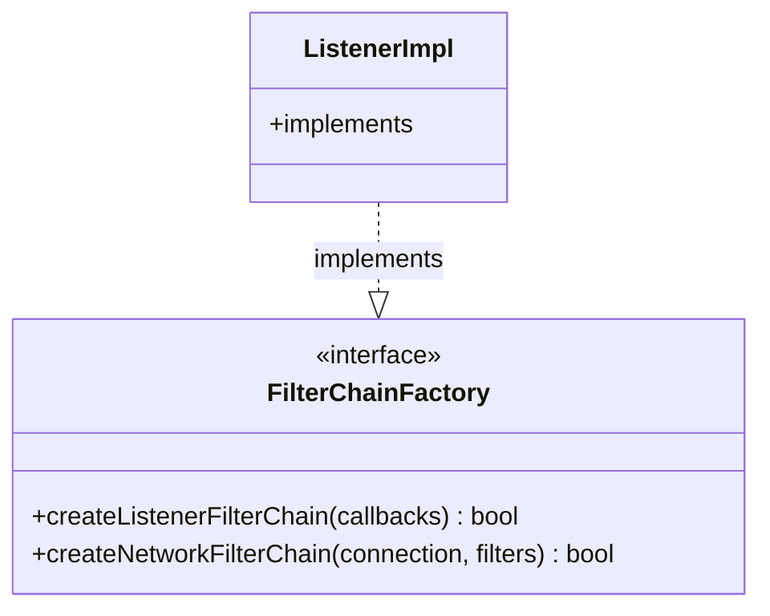

# Part 64: FilterChainFactory

**File:** `envoy/network/filter.h`  
**Namespace:** `Envoy::Network`

## Summary

`FilterChainFactory` creates filter chains for new connections. It provides `createListenerFilterChain` and `createNetworkFilterChain` to set up listener and network filters on a connection.

## UML Diagram

## Important Functions

| Function | One-line description |
|----------|----------------------|
| `createListenerFilterChain(callbacks)` | Creates listener filter chain. |
| `createNetworkFilterChain(connection, filters)` | Creates network filter chain. |
