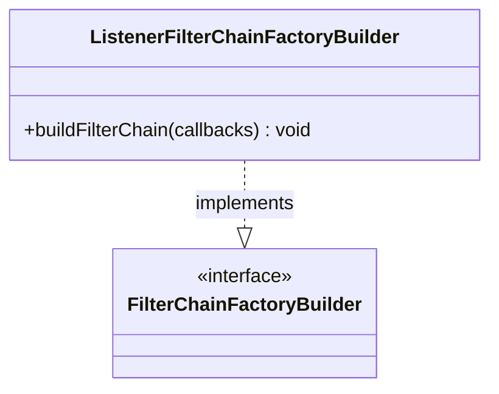

# Part 65: ListenerFilterChainFactoryBuilder

**File:** `source/common/listener_manager/listener_manager_impl.h`  
**Namespace:** `Envoy::Server`

## Summary

`ListenerFilterChainFactoryBuilder` builds listener filter chains from config. It implements `FilterChainFactoryBuilder` and creates the listener filter chain for new connections.

## UML Diagram

## Important Functions

| Function | One-line description |
|----------|----------------------|
| `buildFilterChain(callbacks)` | Builds listener filter chain. |
