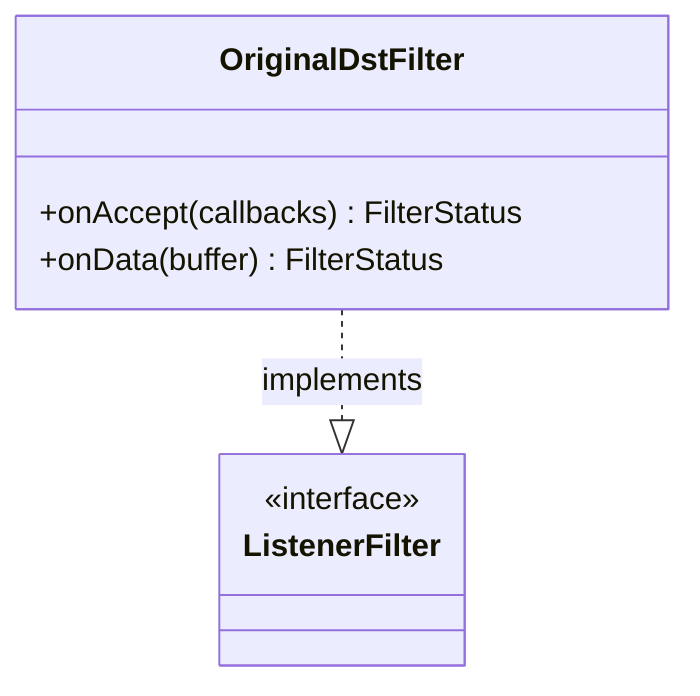

# Part 66: OriginalDstFilter

**File:** `source/extensions/filters/listener/original_dst/original_dst.h`  
**Namespace:** `Envoy::Extensions::ListenerFilters::OriginalDst`

## Summary

`OriginalDstFilter` restores the original destination address from SO_ORIGINAL_DST. Used when `use_original_dst` is set to hand off connections to the listener bound to the original destination.

## UML Diagram

## Important Functions

| Function | One-line description |
|----------|----------------------|
| `onAccept(callbacks)` | Restores original dst on accept. |
| `onData(buffer)` | Handles data if needed. |
