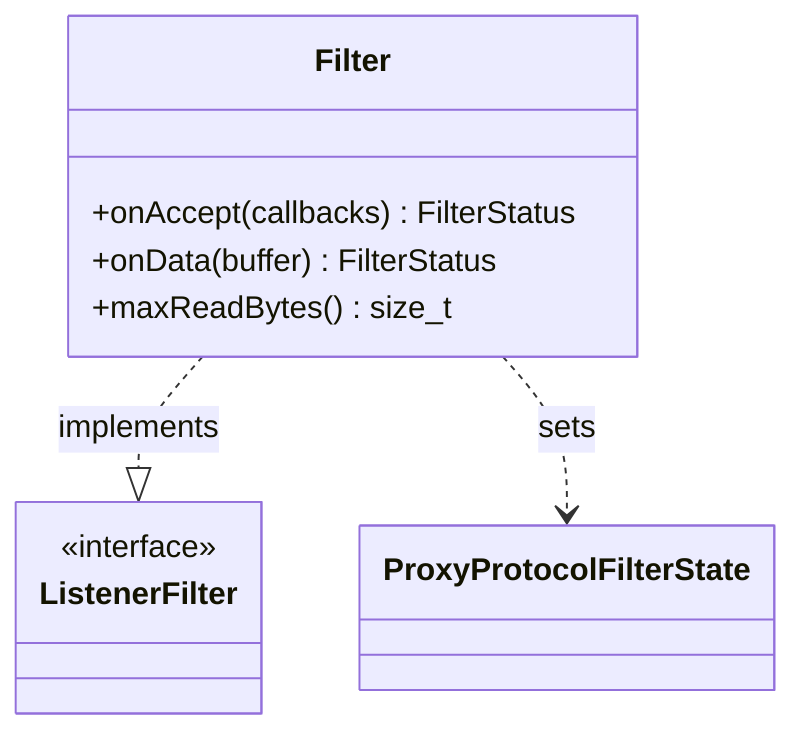

# Part 67: ProxyProtocolFilter

**File:** `source/extensions/filters/listener/proxy_protocol/proxy_protocol.h`  
**Namespace:** `Envoy::Extensions::ListenerFilters::ProxyProtocol`

## Summary

`ProxyProtocol::Filter` parses PROXY protocol (v1/v2) headers to extract client address. Supports TCP/UDP, IPv4/IPv6; stores parsed data in `ProxyProtocolFilterState`.

## UML Diagram

## Important Functions

| Function | One-line description |
|----------|----------------------|
| `onAccept(callbacks)` | Starts PROXY protocol parsing. |
| `onData(buffer)` | Parses PROXY header from buffer. |
| `maxReadBytes()` | Max bytes to read for header. |
