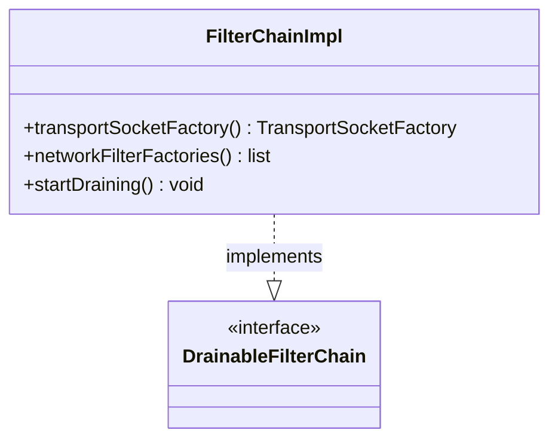

# Part 68: FilterChainImpl

**File:** `source/common/listener_manager/filter_chain_manager_impl.h`  
**Namespace:** `Envoy::Server`

## Summary

`FilterChainImpl` implements `Network::DrainableFilterChain` and holds the concrete filter chain: transport socket factory, network filter factories, and metadata. Created by `FilterChainManagerImpl`.

## UML Diagram

## Important Functions

| Function | One-line description |
|----------|----------------------|
| `transportSocketFactory()` | Returns transport socket factory. |
| `networkFilterFactories()` | Returns network filter factories. |
| `startDraining()` | Starts draining filter chain. |
