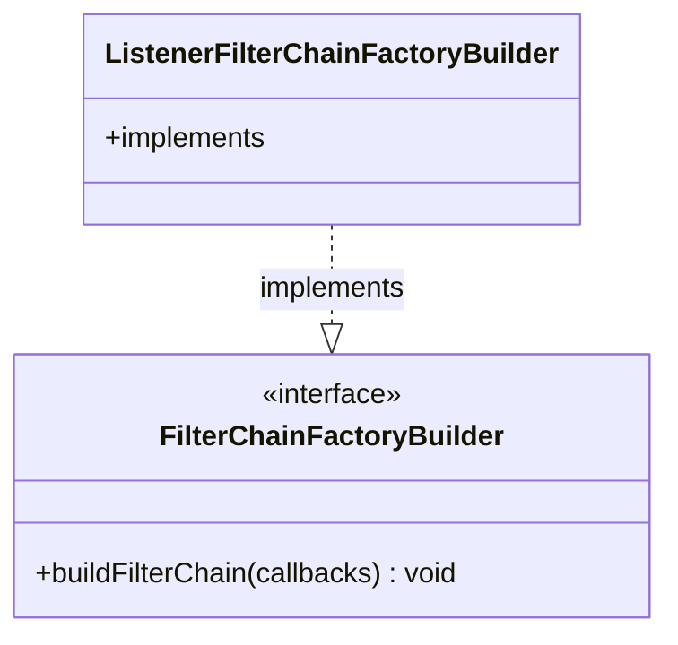

# Part 69: FilterChainFactoryBuilder

**File:** `source/common/listener_manager/filter_chain_manager_impl.h`  
**Namespace:** `Envoy::Server`

## Summary

`FilterChainFactoryBuilder` is the interface for building filter chains from config. `ListenerFilterChainFactoryBuilder` and network filter chain builders implement it.

## UML Diagram

## Important Functions

| Function | One-line description |
|----------|----------------------|
| `buildFilterChain(callbacks)` | Builds filter chain. |
