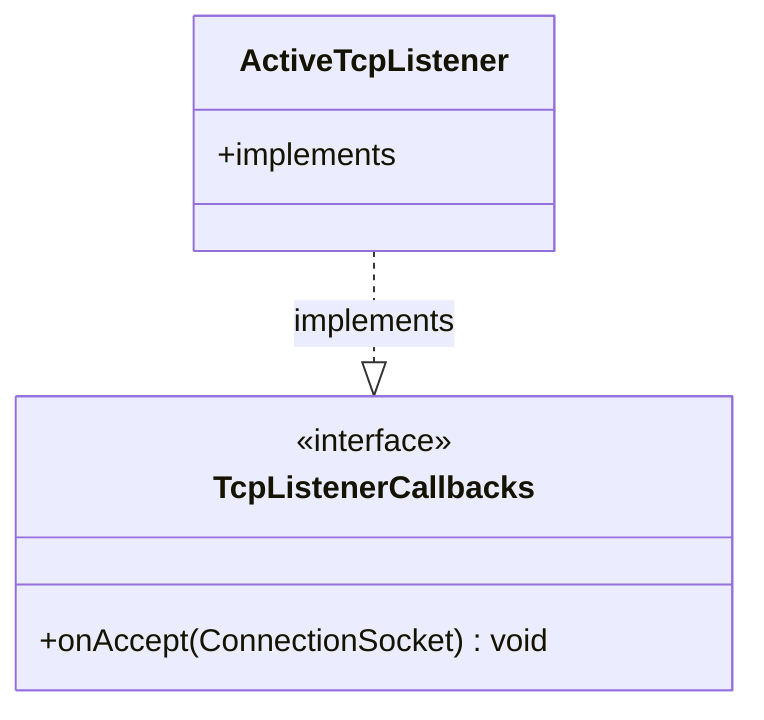

# Part 70: TcpListenerCallbacks

**File:** `envoy/network/listener.h`  
**Namespace:** `Envoy::Network`

## Summary

`TcpListenerCallbacks` is the interface for TCP listener accept callbacks. `onAccept` receives new connections; implemented by `ActiveTcpListener` to create `ActiveTcpSocket` and process listener filters.

## UML Diagram

## Important Functions

| Function | One-line description |
|----------|----------------------|
| `onAccept(socket)` | Handles new connection. |
