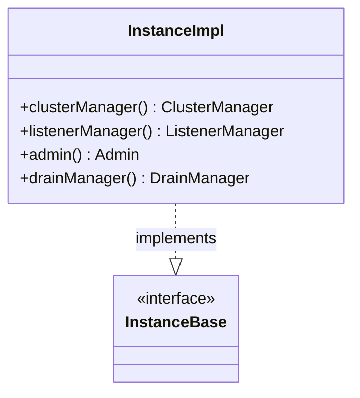

# Part 71: InstanceImpl

**File:** `source/server/instance_impl.h`  
**Namespace:** `Envoy::Server`

## Summary

`InstanceImpl` is the main Envoy server instance. It implements `InstanceBase` and owns cluster manager, listener manager, workers, admin, and runtime. Created during bootstrap.

## UML Diagram

## Important Functions

| Function | One-line description |
|----------|----------------------|
| `clusterManager()` | Returns cluster manager. |
| `listenerManager()` | Returns listener manager. |
| `admin()` | Returns admin interface. |
| `drainManager()` | Returns drain manager. |
