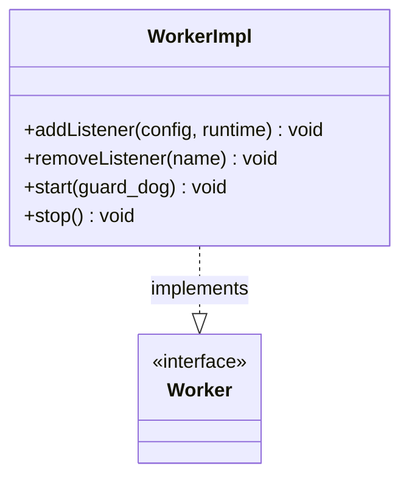

# Part 72: WorkerImpl

**File:** `source/server/worker_impl.h`  
**Namespace:** `Envoy::Server`

## Summary

`WorkerImpl` implements `Worker` and represents a worker thread. It owns the connection handler, dispatcher, and runs the event loop. One per CPU core typically.

## UML Diagram

## Important Functions

| Function | One-line description |
|----------|----------------------|
| `addListener(config, runtime)` | Adds listener to worker. |
| `removeListener(name)` | Removes listener. |
| `start(guard_dog)` | Starts worker event loop. |
| `stop()` | Stops worker. |
