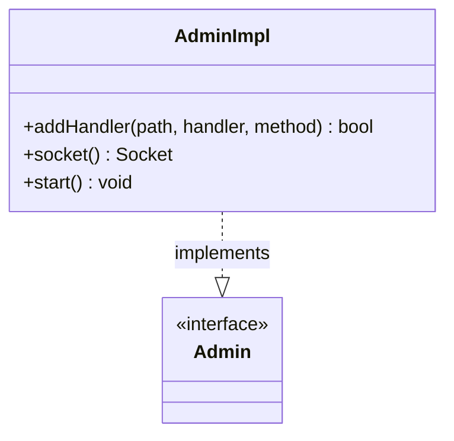

# Part 73: AdminImpl

**File:** `source/server/admin/admin.h`  
**Namespace:** `Envoy::Server`

## Summary

`AdminImpl` implements `Admin` and provides the admin HTTP server. It handles /ready, /stats, /clusters, /config_dump, etc. Implements `FilterChainManager` and `FilterChainFactory` for admin connections.

## UML Diagram

## Important Functions

| Function | One-line description |
|----------|----------------------|
| `addHandler(path, handler, method)` | Adds admin handler. |
| `socket()` | Returns admin socket. |
| `start()` | Starts admin server. |
