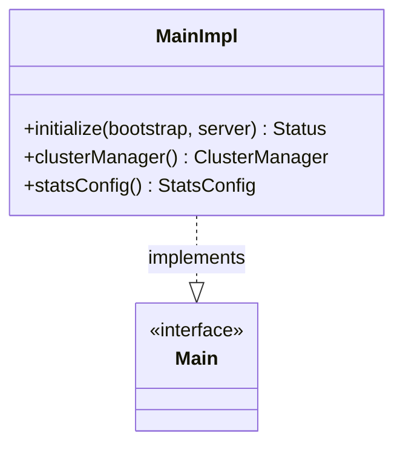

# Part 74: ConfigurationImpl

**File:** `source/server/configuration_impl.h`  
**Namespace:** `Envoy::Server`

## Summary

`ConfigurationImpl` (MainImpl) implements `Server::Configuration::Main` and holds the main config: cluster manager, stats config, watchdogs. Initialized from bootstrap proto.

## UML Diagram

## Important Functions

| Function | One-line description |
|----------|----------------------|
| `initialize(bootstrap, server)` | Initializes from bootstrap. |
| `clusterManager()` | Returns cluster manager. |
| `statsConfig()` | Returns stats config. |
