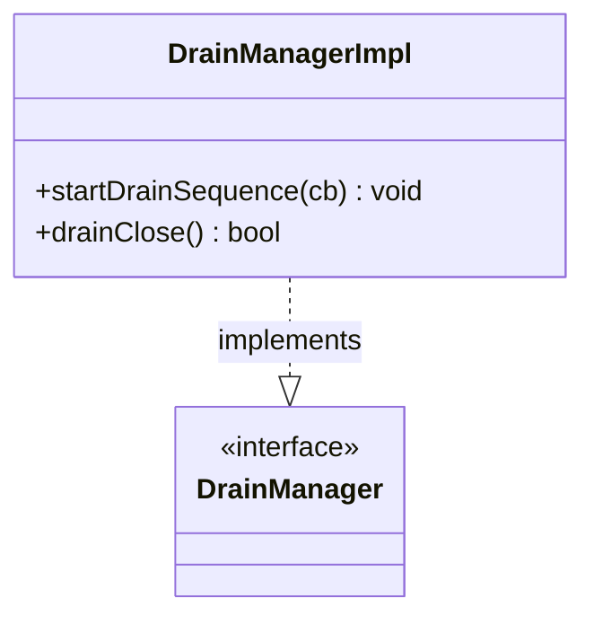

# Part 75: DrainManagerImpl

**File:** `source/server/drain_manager_impl.h`  
**Namespace:** `Envoy::Server`

## Summary

`DrainManagerImpl` implements `DrainManager` and coordinates graceful shutdown. It triggers drain sequencing, waits for connections to drain, and notifies when drain is complete.

## UML Diagram

## Important Functions

| Function | One-line description |
|----------|----------------------|
| `startDrainSequence(cb)` | Starts drain sequence. |
| `drainClose()` | Returns whether to close on drain. |
