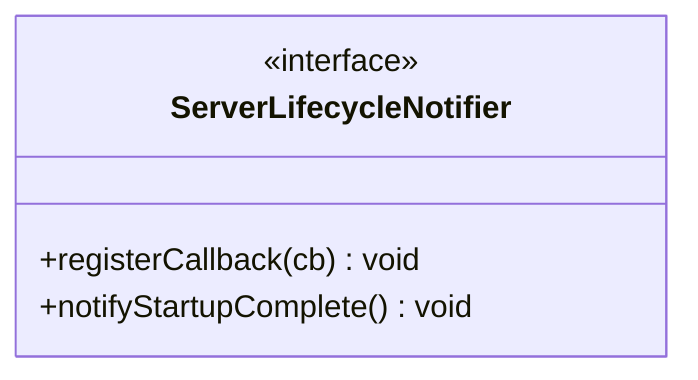

# Part 76: ServerLifecycleNotifier

**File:** `envoy/server/lifecycle_notifier.h`  
**Namespace:** `Envoy::Server`

## Summary

`ServerLifecycleNotifier` notifies listeners of server lifecycle events (e.g. startup complete, shutdown). Components register callbacks to react to these events.

## UML Diagram

## Important Functions

| Function | One-line description |
|----------|----------------------|
| `registerCallback(cb)` | Registers lifecycle callback. |
| `notifyStartupComplete()` | Notifies startup complete. |
