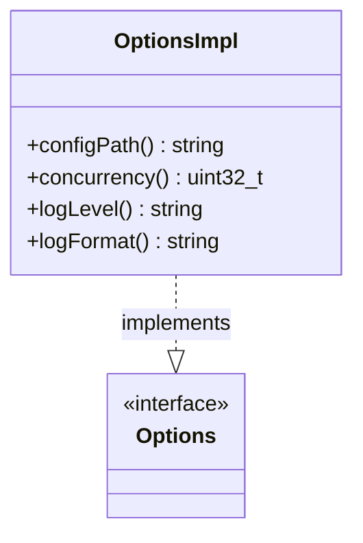

# Part 77: OptionsImpl

**File:** `source/server/options_impl.h`  
**Namespace:** `Envoy::Server`

## Summary

`OptionsImpl` implements `Options` and parses command-line options (config path, log level, concurrency, etc.). Used at startup to configure the server.

## UML Diagram

## Important Functions

| Function | One-line description |
|----------|----------------------|
| `configPath()` | Returns config file path. |
| `concurrency()` | Returns worker count. |
| `logLevel()` | Returns log level. |
| `logFormat()` | Returns log format. |
