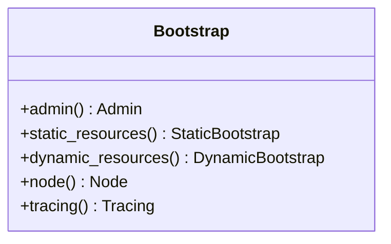

# Part 78: Bootstrap

**File:** `envoy/config/bootstrap/v3/bootstrap.pb.h`  
**Namespace:** `envoy::config::bootstrap::v3`

## Summary

`Bootstrap` is the root configuration proto for Envoy. It defines admin, static resources (listeners, clusters), dynamic resources (LDS, CDS, RDS), tracing, and runtime.

## UML Diagram

## Important Functions

| Function | One-line description |
|----------|----------------------|
| `admin()` | Admin config. |
| `static_resources()` | Static listeners, clusters. |
| `dynamic_resources()` | xDS config. |
| `node()` | Node identity. |
