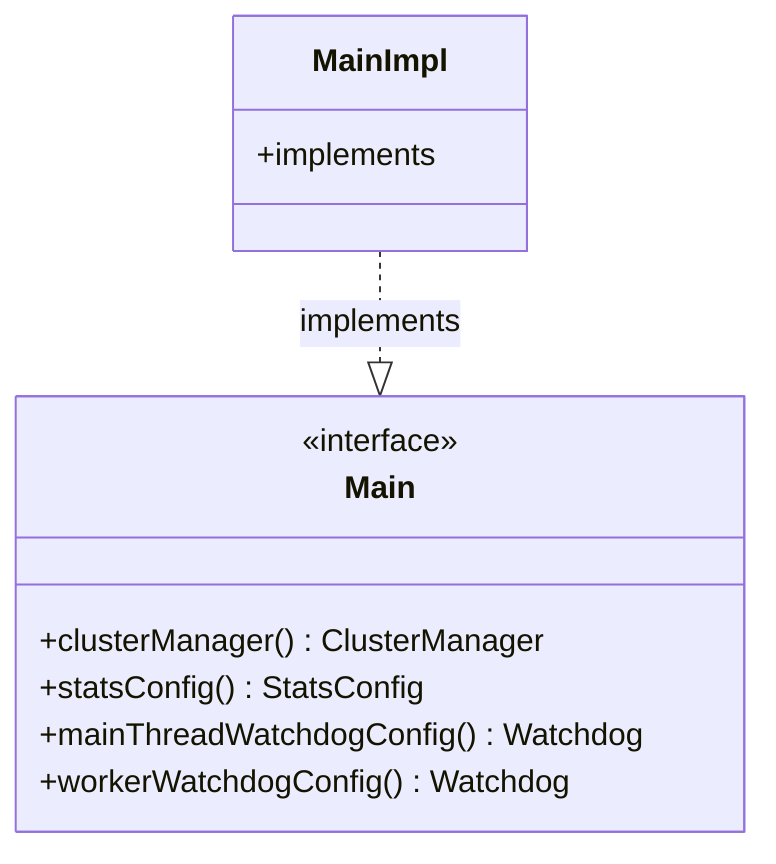

# Part 79: Main

**File:** `envoy/server/configuration.h`  
**Namespace:** `Envoy::Server::Configuration`

## Summary

`Main` is the interface for main server configuration. It provides cluster manager, stats config, and watchdog config. Implemented by `MainImpl`.

## UML Diagram

## Important Functions

| Function | One-line description |
|----------|----------------------|
| `clusterManager()` | Returns cluster manager. |
| `statsConfig()` | Returns stats config. |
| `mainThreadWatchdogConfig()` | Returns main watchdog config. |
