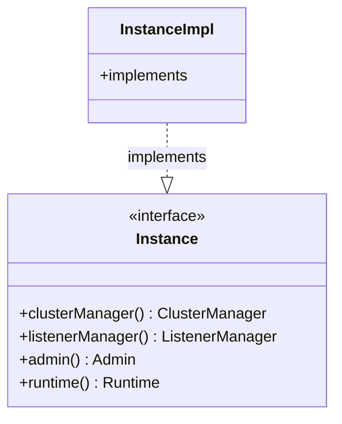

# Part 80: Instance

**File:** `envoy/server/instance.h`  
**Namespace:** `Envoy::Server`

## Summary

`Instance` is the interface for the Envoy server instance. It provides cluster manager, listener manager, admin, runtime, and other core components. Implemented by `InstanceImpl`.

## UML Diagram

## Important Functions

| Function | One-line description |
|----------|----------------------|
| `clusterManager()` | Returns cluster manager. |
| `listenerManager()` | Returns listener manager. |
| `admin()` | Returns admin. |
| `runtime()` | Returns runtime. |
