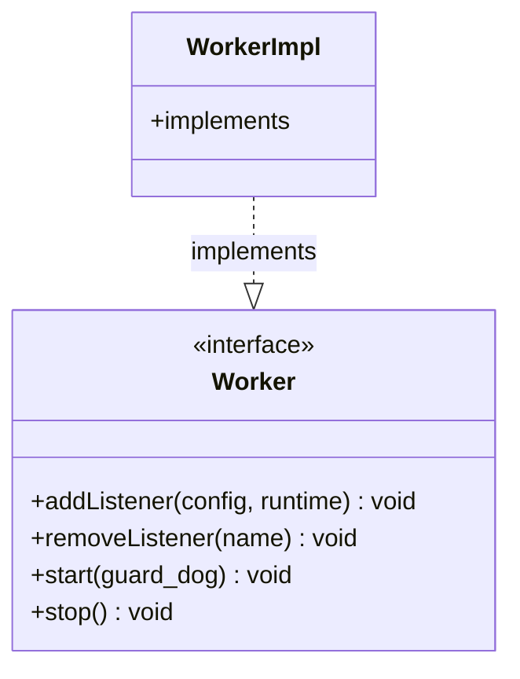

# Part 81: Worker

**File:** `envoy/server/worker.h`  
**Namespace:** `Envoy::Server`

## Summary

`Worker` is the interface for a worker thread. It owns the connection handler and dispatcher, adds/removes listeners, and runs the event loop. Implemented by `WorkerImpl`.

## UML Diagram

## Important Functions

| Function | One-line description |
|----------|----------------------|
| `addListener(config, runtime)` | Adds listener. |
| `removeListener(name)` | Removes listener. |
| `start(guard_dog)` | Starts worker. |
| `stop()` | Stops worker. |
