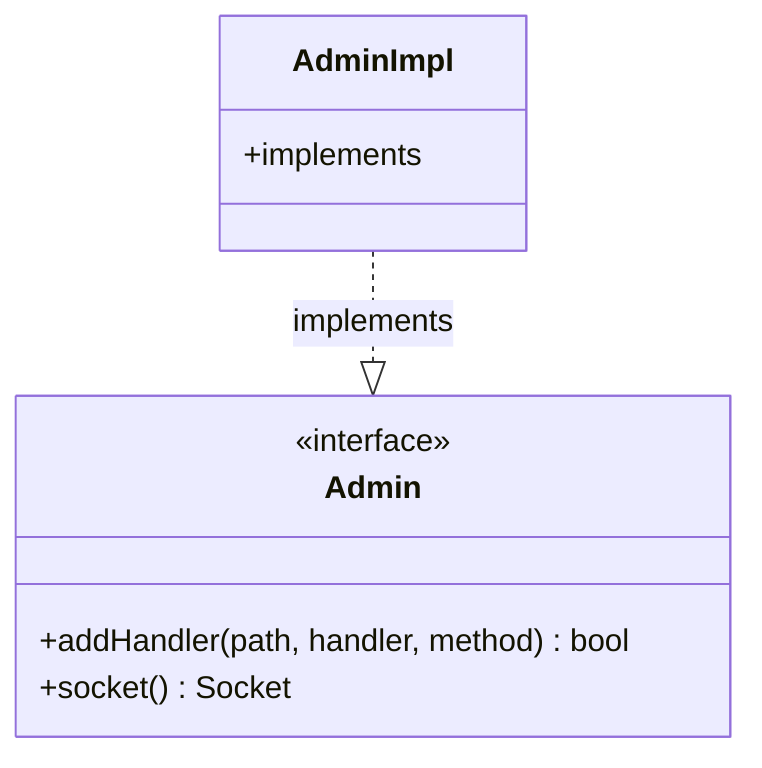

# Part 82: Admin

**File:** `envoy/server/configuration.h`, `envoy/server/admin.h`  
**Namespace:** `Envoy::Server`

## Summary

`Admin` is the interface for the admin HTTP server. It provides handlers for /ready, /stats, /clusters, config dump, etc. Implemented by `AdminImpl`.

## UML Diagram

## Important Functions

| Function | One-line description |
|----------|----------------------|
| `addHandler(path, handler, method)` | Adds admin handler. |
| `socket()` | Returns admin socket. |
