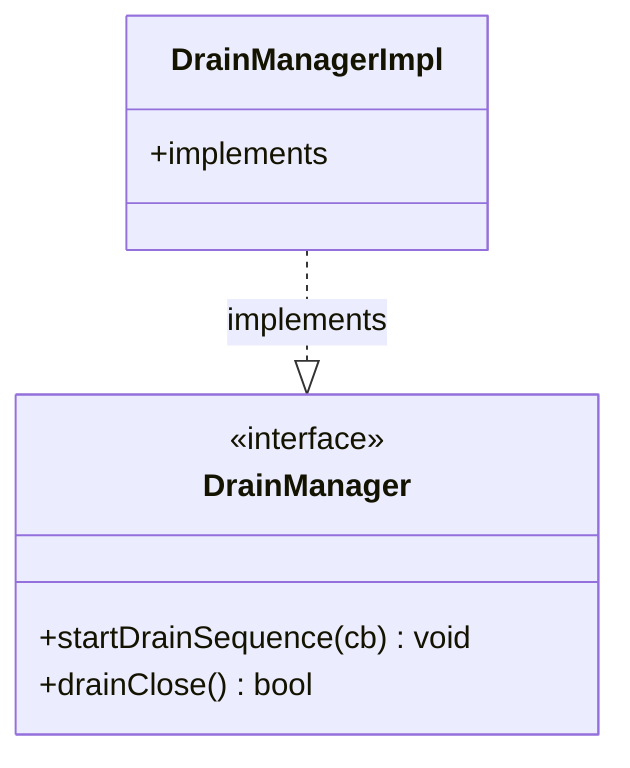

# Part 83: DrainManager

**File:** `envoy/server/drain_manager.h`  
**Namespace:** `Envoy::Server`

## Summary

`DrainManager` coordinates graceful shutdown. It implements `Network::DrainDecision` and `ThreadLocal::ThreadLocalObject`. Implemented by `DrainManagerImpl`.

## UML Diagram

## Important Functions

| Function | One-line description |
|----------|----------------------|
| `startDrainSequence(cb)` | Starts drain. |
| `drainClose()` | Whether to close on drain. |
