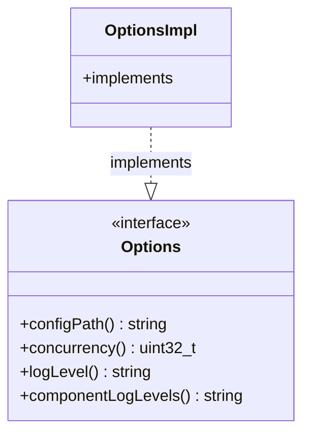

# Part 84: Options

**File:** `envoy/server/options.h`  
**Namespace:** `Envoy::Server`

## Summary

`Options` is the interface for command-line and startup options. It provides config path, concurrency, log level, and other runtime options. Implemented by `OptionsImpl`.

## UML Diagram

## Important Functions

| Function | One-line description |
|----------|----------------------|
| `configPath()` | Returns config path. |
| `concurrency()` | Returns worker count. |
| `logLevel()` | Returns log level. |
