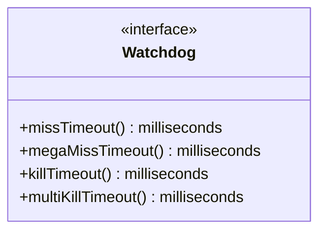

# Part 85: Watchdog

**File:** `envoy/server/configuration.h`  
**Namespace:** `Envoy::Server::Configuration`

## Summary

`Watchdog` configures thread responsiveness monitoring. It provides miss/mega-miss/kill timeouts and multi-kill thresholds. Used for main and worker watchdog config during server init.

## UML Diagram

## Important Functions

| Function | One-line description |
|----------|----------------------|
| `missTimeout()` | Time for miss statistic. |
| `megaMissTimeout()` | Time for mega-miss. |
| `killTimeout()` | Time before process kill. |
| `multiKillTimeout()` | Time for multi-thread kill. |
