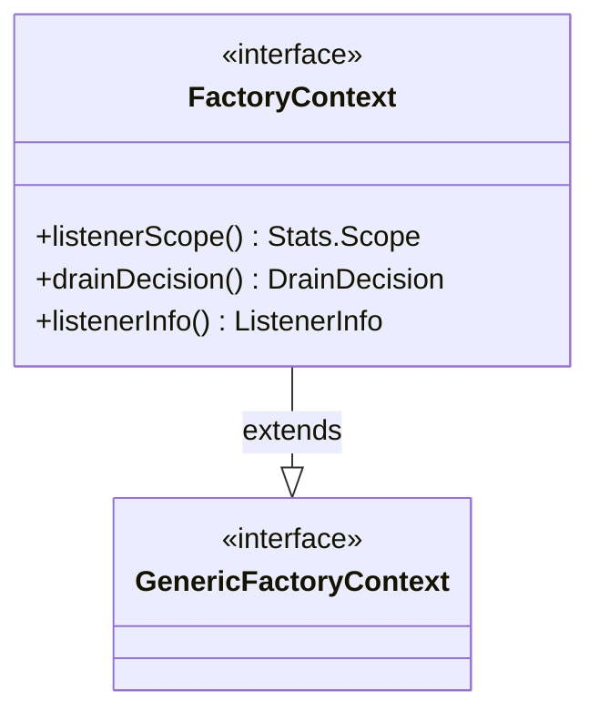

# Part 87: FactoryContext

**File:** `envoy/server/factory_context.h`  
**Namespace:** `Envoy::Server::Configuration`

## Summary

`FactoryContext` is the context passed to filter factories. It provides listener scope, drain decision, listener info, cluster manager, and other server resources. Extends `GenericFactoryContext`.

## UML Diagram

## Important Functions

| Function | One-line description |
|----------|----------------------|
| `listenerScope()` | Returns listener stats scope. |
| `drainDecision()` | Returns drain decision. |
| `listenerInfo()` | Returns listener info. |
