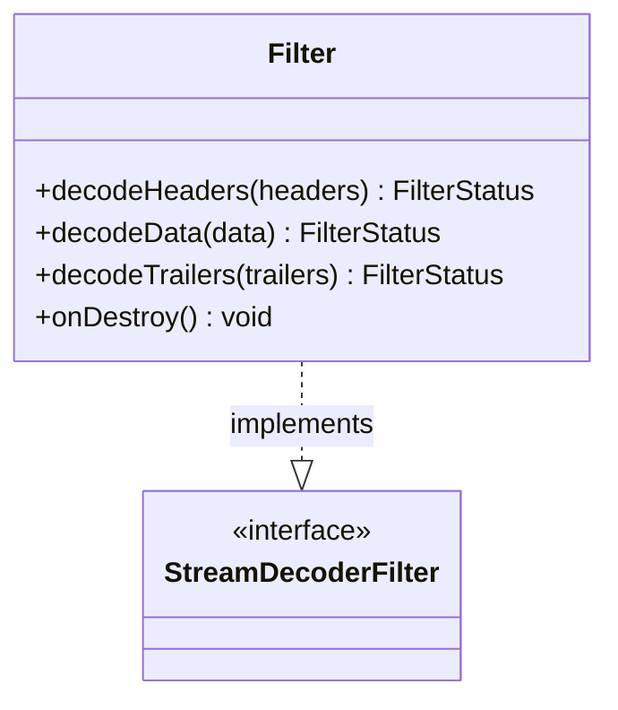

# Part 88: Router::Filter

**File:** `source/common/router/router.h`  
**Namespace:** `Envoy::Router`

## Summary

`Router::Filter` is the HTTP router filter. It implements `Http::StreamDecoderFilter`, selects upstream cluster/route, creates connections via connection pool, and forwards requests.

## UML Diagram

## Important Functions

| Function | One-line description |
|----------|----------------------|
| `decodeHeaders(headers)` | Routes request, starts upstream. |
| `decodeData(data)` | Forwards data upstream. |
| `decodeTrailers(trailers)` | Forwards trailers. |
| `onDestroy()` | Cleans up on stream end. |
