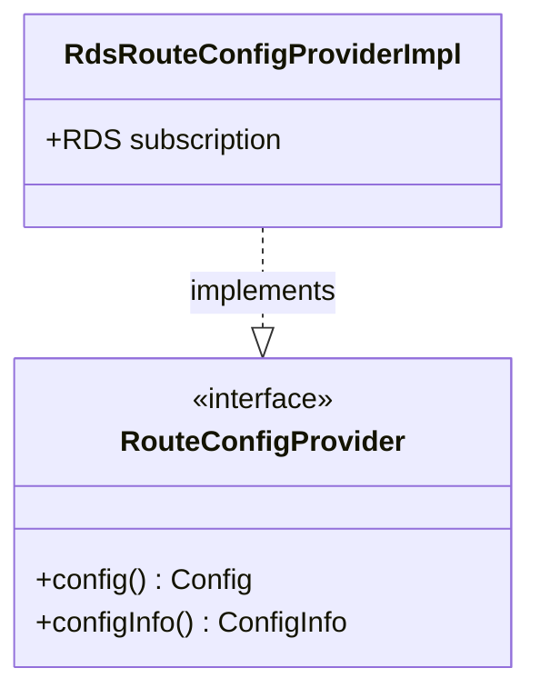

# Part 89: RdsRouteConfigProvider

**File:** `envoy/router/rds.h`, `envoy/rds/route_config_provider.h`  
**Namespace:** `Envoy::Router`, `Envoy::Rds`

## Summary

`RouteConfigProvider` (RDS) provides route configuration. It can be static or dynamic (xDS). `RdsRouteConfigProviderImpl` subscribes to RDS and updates route config.

## UML Diagram

## Important Functions

| Function | One-line description |
|----------|----------------------|
| `config()` | Returns current route config. |
| `configInfo()` | Returns config version info. |
